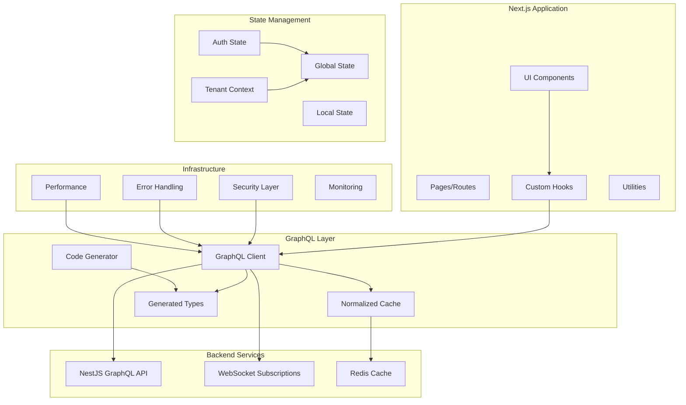
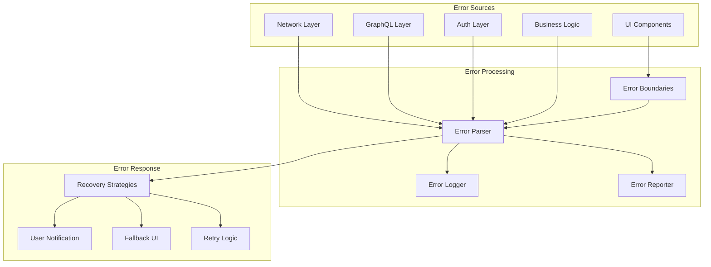

# Design Document: Next.js GraphQL Foundation

## Overview

This design outlines a comprehensive Next.js frontend foundation that integrates with an enterprise-grade NestJS GraphQL backend. The architecture prioritizes type safety, performance, scalability, and developer experience while supporting multi-tenancy, real-time capabilities, and enterprise security requirements.

The foundation leverages GraphQL's introspective capabilities to generate a fully type-safe development environment, implements sophisticated caching strategies that respect backend patterns, and provides a modular architecture that scales with business complexity.

## Architecture

### High-Level Architecture



### Technology Stack Decision

**GraphQL Client: Apollo Client**
Based on research, Apollo Client is selected over URQL for enterprise requirements due to:
- Superior normalized caching with automatic cache updates
- Mature ecosystem with extensive enterprise features
- Better support for complex subscription management
- Advanced developer tools and debugging capabilities
- Proven track record in large-scale applications

**Type Generation: GraphQL Code Generator**
- Industry standard for GraphQL type generation
- Excellent Next.js integration
- Supports multiple output formats and plugins
- Active maintenance and community support

**State Management: Zustand + Apollo Cache**
- Zustand for global application state (auth, tenant, features)
- Apollo Cache for GraphQL data state
- Minimal boilerplate compared to Redux
- Excellent TypeScript support

## Components and Interfaces

### Core Components

#### 1. GraphQL Client Configuration

```typescript
// lib/apollo-client.ts
interface ApolloClientConfig {
  uri: string;
  headers: Record<string, string>;
  cache: InMemoryCache;
  subscriptionClient: SubscriptionClient;
  errorLink: ErrorLink;
  authLink: AuthLink;
  retryLink: RetryLink;
}

interface CacheConfig {
  typePolicies: TypePolicies;
  possibleTypes: PossibleTypesMap;
  dataIdFromObject: (object: any) => string;
}
```

#### 2. Authentication Manager

```typescript
// lib/auth/auth-manager.ts
interface AuthManager {
  login(credentials: LoginCredentials): Promise<AuthResult>;
  logout(): Promise<void>;
  refreshToken(): Promise<string>;
  getCurrentUser(): User | null;
  hasPermission(permission: Permission): boolean;
  setupMFA(method: MFAMethod): Promise<MFASetupResult>;
  verifyMFA(code: string): Promise<boolean>;
}

interface AuthState {
  user: User | null;
  tokens: TokenPair | null;
  permissions: Permission[];
  mfaRequired: boolean;
  isAuthenticated: boolean;
  isLoading: boolean;
}
```

#### 3. Tenant Context Manager

```typescript
// lib/tenant/tenant-context.ts
interface TenantContext {
  currentTenant: Tenant | null;
  availableTenants: Tenant[];
  businessTier: BusinessTier;
  features: FeatureFlag[];
  switchTenant(tenantId: string): Promise<void>;
  hasFeature(feature: string): boolean;
  getFeatureConfig(feature: string): FeatureConfig;
}

interface Tenant {
  id: string;
  name: string;
  subdomain: string;
  businessTier: BusinessTier;
  settings: TenantSettings;
  branding: BrandingConfig;
}

type BusinessTier = 'MICRO' | 'SMALL' | 'MEDIUM' | 'ENTERPRISE';
```

#### 4. Subscription Manager

```typescript
// lib/subscriptions/subscription-manager.ts
interface SubscriptionManager {
  subscribe<T>(
    subscription: DocumentNode,
    variables?: any,
    options?: SubscriptionOptions
  ): Observable<T>;
  unsubscribe(subscriptionId: string): void;
  reconnect(): Promise<void>;
  getConnectionStatus(): ConnectionStatus;
}

interface SubscriptionOptions {
  tenantFilter?: string;
  errorPolicy?: ErrorPolicy;
  fetchPolicy?: FetchPolicy;
  onError?: (error: Error) => void;
  onConnectionChange?: (status: ConnectionStatus) => void;
}
```

#### 5. Cache Layer

```typescript
// lib/cache/cache-layer.ts
interface CacheLayer {
  get<T>(key: string): Promise<T | null>;
  set<T>(key: string, value: T, ttl?: number): Promise<void>;
  invalidate(pattern: string): Promise<void>;
  warm(keys: string[]): Promise<void>;
  getStats(): CacheStats;
}

interface CacheStrategy {
  cacheFirst: boolean;
  networkFirst: boolean;
  cacheOnly: boolean;
  networkOnly: boolean;
  cacheAndNetwork: boolean;
}
```

### Module Structure

```
src/
├── components/           # Reusable UI components
│   ├── common/          # Common components
│   ├── forms/           # Form components
│   └── layout/          # Layout components
├── modules/             # Business modules (18+)
│   ├── auth/
│   ├── tenant/
│   ├── warehouse/
│   ├── pos/
│   ├── inventory/
│   ├── financial/
│   ├── supplier/
│   ├── employee/
│   ├── crm/
│   ├── location/
│   ├── integration/
│   ├── communication/
│   ├── realtime/
│   ├── security/
│   ├── queue/
│   ├── cache/
│   ├── analytics/
│   └── health/
├── lib/                 # Core libraries
│   ├── apollo/          # GraphQL client setup
│   ├── auth/            # Authentication logic
│   ├── tenant/          # Multi-tenant logic
│   ├── cache/           # Caching strategies
│   ├── subscriptions/   # Real-time subscriptions
│   ├── security/        # Security utilities
│   └── utils/           # General utilities
├── hooks/               # Custom React hooks
├── types/               # Generated and custom types
├── graphql/             # GraphQL operations
│   ├── queries/
│   ├── mutations/
│   ├── subscriptions/
│   └── fragments/
└── pages/               # Next.js pages
```

## Data Models

### Core Data Models

#### User and Authentication

```typescript
interface User {
  id: string;
  email: string;
  firstName: string;
  lastName: string;
  avatar?: string;
  tenants: UserTenant[];
  permissions: Permission[];
  mfaEnabled: boolean;
  lastLoginAt: Date;
  createdAt: Date;
  updatedAt: Date;
}

interface UserTenant {
  tenantId: string;
  role: Role;
  permissions: Permission[];
  isActive: boolean;
}

interface TokenPair {
  accessToken: string;
  refreshToken: string;
  expiresAt: Date;
  tokenType: 'Bearer';
}
```

#### Multi-Tenant Models

```typescript
interface TenantSettings {
  timezone: string;
  currency: string;
  dateFormat: string;
  language: string;
  features: Record<string, boolean>;
  limits: TenantLimits;
}

interface TenantLimits {
  maxUsers: number;
  maxStorage: number;
  maxApiCalls: number;
  maxIntegrations: number;
}

interface FeatureFlag {
  key: string;
  enabled: boolean;
  config: Record<string, any>;
  requiredTier: BusinessTier;
}
```

#### GraphQL Operation Models

```typescript
interface GraphQLOperation {
  query: DocumentNode;
  variables?: Record<string, any>;
  context?: Record<string, any>;
  errorPolicy?: ErrorPolicy;
  fetchPolicy?: FetchPolicy;
}

interface GraphQLError {
  message: string;
  locations?: Array<{ line: number; column: number }>;
  path?: Array<string | number>;
  extensions?: Record<string, any>;
}
```

## Correctness Properties

*A property is a characteristic or behavior that should hold true across all valid executions of a system—essentially, a formal statement about what the system should do. Properties serve as the bridge between human-readable specifications and machine-verifiable correctness guarantees.*

### GraphQL Client Properties

Property 1: Request deduplication
*For any* set of identical GraphQL queries made simultaneously, the client should make only one network request and share the result across all callers
**Validates: Requirements 1.1, 1.2**

Property 2: Cache consistency after mutations
*For any* GraphQL mutation that affects cached data, all relevant cache entries should be automatically updated to reflect the changes
**Validates: Requirements 1.3, 1.4**

Property 3: Optimistic update rollback
*For any* optimistic update that fails, the client should rollback to the previous state and display the actual server response
**Validates: Requirements 1.5**

Property 4: Exponential backoff retry
*For any* failed network request, the retry intervals should follow exponential backoff pattern with jitter
**Validates: Requirements 1.6**

Property 5: Interceptor invocation
*For any* GraphQL operation, all configured request and response interceptors should be called in the correct order
**Validates: Requirements 1.7**

### Type Generation Properties

Property 6: Schema-to-type consistency
*For any* valid GraphQL schema, the generated TypeScript types should accurately represent all schema types and their relationships
**Validates: Requirements 2.1**

Property 7: Breaking change detection
*For any* schema change that breaks existing operations, the type generator should identify and report the breaking changes
**Validates: Requirements 2.2**

Property 8: Operation hook generation
*For any* valid GraphQL operation, the generator should create a corresponding typed React hook with correct input and output types
**Validates: Requirements 2.3**

Property 9: Operation validation
*For any* GraphQL operation, validation against the schema should catch type mismatches and invalid field selections at build time
**Validates: Requirements 2.4**

Property 10: Fragment type composition
*For any* GraphQL fragment used in operations, the generated types should correctly compose fragment types with operation types
**Validates: Requirements 2.5**

Property 11: Union type discrimination
*For any* GraphQL union or interface type, the generated TypeScript should create proper discriminated unions with type guards
**Validates: Requirements 2.6**

Property 12: Clear error messaging
*For any* invalid GraphQL operation, the type generator should provide error messages that clearly identify the issue and suggest fixes
**Validates: Requirements 2.7**

### Authentication Properties

Property 13: Token lifecycle management
*For any* authentication session, tokens should be stored securely and refreshed automatically before expiration
**Validates: Requirements 3.1, 3.2**

Property 14: MFA flow completion
*For any* supported MFA method (TOTP, SMS), the authentication flow should complete successfully when valid codes are provided
**Validates: Requirements 3.3**

Property 15: Secure token storage
*For any* authentication token, storage should prevent XSS attacks and unauthorized access
**Validates: Requirements 3.4**

Property 16: Permission-based rendering
*For any* UI component with permission requirements, the component should only render when the user has the required permissions
**Validates: Requirements 3.5, 3.6**

Property 17: Cross-tab session sync
*For any* authentication state change in one browser tab, all other tabs should reflect the change within a reasonable time
**Validates: Requirements 3.7**

Property 18: Authentication failure cleanup
*For any* authentication failure, all sensitive data should be cleared and the user should be redirected to login
**Validates: Requirements 3.8**

### Multi-Tenant Properties

Property 19: Tenant context consistency
*For any* tenant switch, all tenant-specific configuration and feature flags should be updated consistently across the application
**Validates: Requirements 4.1, 4.2**

Property 20: Progressive feature disclosure
*For any* business tier and feature combination, features should only be available if the tenant's tier supports them
**Validates: Requirements 4.3**

Property 21: Tenant cache isolation
*For any* tenant-specific data, cache entries should be isolated and not accessible by other tenants
**Validates: Requirements 4.4, 4.5**

Property 22: Tenant access validation
*For any* operation, the system should validate that the current tenant has access before proceeding
**Validates: Requirements 4.6**

Property 23: Tenant theming application
*For any* tenant with custom branding, the theme should be applied consistently across all UI components
**Validates: Requirements 4.7**

### Real-Time Properties

Property 24: Subscription connection management
*For any* GraphQL subscription, a WebSocket connection should be established and maintained with automatic reconnection on failure
**Validates: Requirements 5.1, 5.2**

Property 25: Tenant-filtered subscriptions
*For any* subscription event, only events relevant to the current tenant should be delivered to the client
**Validates: Requirements 5.3**

Property 26: Connection pooling efficiency
*For any* set of subscriptions, connections should be pooled to minimize resource usage while maintaining functionality
**Validates: Requirements 5.4**

Property 27: Subscription cache updates
*For any* subscription data received, the GraphQL cache should be updated automatically to reflect the new data
**Validates: Requirements 5.5**

Property 28: Subscription authentication
*For any* subscription, authentication should be maintained throughout the connection lifecycle with automatic re-authentication
**Validates: Requirements 5.6**

Property 29: Subscription status indication
*For any* active subscription, users should receive clear status indicators about connection state
**Validates: Requirements 5.7**

### State Management Properties

Property 30: Global state consistency
*For any* global state change (auth, tenant, features), all dependent components should receive updates consistently
**Validates: Requirements 6.1, 6.5**

Property 31: Cache-state synchronization
*For any* state change that affects GraphQL data, the cache and global state should remain synchronized
**Validates: Requirements 6.2**

Property 32: Cross-tab state sync
*For any* authentication state change, all browser tabs should synchronize within a reasonable time window
**Validates: Requirements 6.3**

Property 33: Optimistic update rollback
*For any* failed optimistic update, the state should rollback to the previous valid state
**Validates: Requirements 6.4**

Property 34: State persistence
*For any* critical state data, it should persist across browser sessions and be restored on application restart
**Validates: Requirements 6.6**

Property 35: State debugging capability
*For any* state change, debugging tools should provide clear visibility into state transitions and current values
**Validates: Requirements 6.7**

### Caching Properties

Property 36: Multi-tier cache consistency
*For any* cached data, all cache tiers should maintain consistency with backend Redis patterns
**Validates: Requirements 7.1**

Property 37: Mutation-based invalidation
*For any* GraphQL mutation, affected cache entries should be invalidated according to the mutation's impact
**Validates: Requirements 7.2, 7.3**

Property 38: Cache warming effectiveness
*For any* critical business data, cache warming should pre-populate frequently accessed data
**Validates: Requirements 7.4**

Property 39: Offline cache behavior
*For any* operation in offline mode, cache-first strategies should provide data when available
**Validates: Requirements 7.5**

Property 40: Tenant cache isolation
*For any* tenant's cached data, it should be completely isolated from other tenants' cache entries
**Validates: Requirements 7.6**

Property 41: Cache metrics accuracy
*For any* cache operation, hit/miss metrics should be accurately recorded for performance monitoring
**Validates: Requirements 7.7**

### Performance Properties

Property 42: Module-based code splitting
*For any* business module, code should be split into separate bundles that load only when needed
**Validates: Requirements 8.1, 8.6**

Property 43: Lazy loading behavior
*For any* non-critical component, it should only load when actually needed by the user
**Validates: Requirements 8.2**

Property 44: Bundle optimization
*For any* production build, unused code should be eliminated through tree shaking and dead code elimination
**Validates: Requirements 8.3**

Property 45: SSR/SSG optimization
*For any* page that benefits from server-side rendering, initial load performance should be optimized
**Validates: Requirements 8.4**

Property 46: Image optimization
*For any* image in the application, format selection and lazy loading should be applied automatically
**Validates: Requirements 8.5**

Property 47: Performance metrics collection
*For any* performance-critical operation, metrics should be collected and made available for monitoring
**Validates: Requirements 8.7**

### Error Handling Properties

Property 48: Error boundary containment
*For any* React component error, error boundaries should contain the error and provide fallback UI
**Validates: Requirements 9.1**

Property 49: GraphQL error parsing
*For any* GraphQL error response, errors should be parsed and presented in user-friendly format
**Validates: Requirements 9.2**

Property 50: Network error retry
*For any* network error, retry logic should be applied with appropriate user feedback
**Validates: Requirements 9.3**

Property 51: Secure error logging
*For any* error logged for debugging, sensitive information should be filtered out
**Validates: Requirements 9.4**

Property 52: Contextual error messages
*For any* error, the message should be appropriate for the user's permission level and context
**Validates: Requirements 9.5**

Property 53: Error recovery strategies
*For any* error type, appropriate recovery strategies should be applied automatically when possible
**Validates: Requirements 9.6**

Property 54: Error reporting integration
*For any* error that should be reported, it should be sent to monitoring services with appropriate metadata
**Validates: Requirements 9.7**

### Development Experience Properties

Property 55: Hot reload functionality
*For any* code change during development, hot reloading should update the application without losing state
**Validates: Requirements 10.1**

Property 56: TypeScript strict enforcement
*For any* TypeScript code, strict mode should catch type errors and enforce comprehensive type checking
**Validates: Requirements 10.2**

Property 57: Code quality enforcement
*For any* code file, ESLint and Prettier should enforce consistent style and catch potential issues
**Validates: Requirements 10.3**

Property 58: Testing infrastructure completeness
*For any* component or function, appropriate testing infrastructure should be available for unit and integration tests
**Validates: Requirements 10.4**

Property 59: API documentation generation
*For any* GraphQL schema, comprehensive API documentation should be automatically generated
**Validates: Requirements 10.5**

Property 60: GraphQL playground integration
*For any* GraphQL operation, developers should be able to test and explore it through integrated playground tools
**Validates: Requirements 10.6**

Property 61: Debugging tool availability
*For any* GraphQL operation or cache state, debugging tools should provide clear visibility and inspection capabilities
**Validates: Requirements 10.7**

### Module Organization Properties

Property 62: Module structure consistency
*For any* business module, it should follow the same organizational patterns and structure as other modules
**Validates: Requirements 11.1, 11.2**

Property 63: Shared utility availability
*For any* cross-module functionality, shared utilities and components should be accessible to all modules
**Validates: Requirements 11.3**

Property 64: Domain boundary enforcement
*For any* module, domain boundaries should be clearly defined and enforced
**Validates: Requirements 11.4**

Property 65: Module routing independence
*For any* module, routing and navigation should work independently without affecting other modules
**Validates: Requirements 11.5**

Property 66: Module development independence
*For any* module, it should be possible to develop and test it independently of other modules
**Validates: Requirements 11.6**

Property 67: Module dependency resolution
*For any* module dependency, the system should correctly resolve and manage dependencies
**Validates: Requirements 11.7**

### Security Properties

Property 68: XSS protection effectiveness
*For any* user-generated content, XSS protection should prevent malicious script execution
**Validates: Requirements 12.1**

Property 69: CSRF attack prevention
*For any* state-changing request, CSRF tokens should be validated to prevent unauthorized actions
**Validates: Requirements 12.2**

Property 70: Token storage security
*For any* authentication token, storage should prevent unauthorized access and XSS attacks
**Validates: Requirements 12.3**

Property 71: Permission validation completeness
*For any* user action, permissions should be validated before allowing the action to proceed
**Validates: Requirements 12.4**

Property 72: Security audit logging
*For any* security-relevant event, appropriate audit logs should be created with necessary metadata
**Validates: Requirements 12.5**

Property 73: Compliance requirement adherence
*For any* applicable compliance requirement (GDPR, SOC2, PCI-DSS, HIPAA), the system should meet the necessary standards
**Validates: Requirements 12.6**

Property 74: Input/output sanitization
*For any* user input or API response, data should be properly sanitized to prevent security vulnerabilities
**Validates: Requirements 12.7**

<function_calls>
<invoke name="prework">
<parameter name="featureName">nextjs-graphql-foundation

## Error Handling

### Error Classification

The system implements a comprehensive error handling strategy that categorizes errors into distinct types:

1. **Network Errors**: Connection failures, timeouts, DNS resolution issues
2. **GraphQL Errors**: Schema validation errors, resolver errors, permission errors
3. **Authentication Errors**: Token expiration, invalid credentials, MFA failures
4. **Authorization Errors**: Insufficient permissions, tenant access violations
5. **Validation Errors**: Input validation failures, business rule violations
6. **System Errors**: Runtime exceptions, memory issues, unexpected failures

### Error Handling Architecture



### Error Recovery Strategies

**Automatic Recovery**:
- Network errors: Exponential backoff retry with circuit breaker
- Token expiration: Automatic refresh with fallback to login
- Cache misses: Fallback to network requests
- Subscription disconnections: Automatic reconnection with state restoration

**User-Guided Recovery**:
- Permission errors: Clear messaging with suggested actions
- Validation errors: Inline feedback with correction guidance
- Business rule violations: Contextual explanations with alternatives

**Graceful Degradation**:
- Offline mode: Cache-first operation with sync on reconnection
- Feature unavailability: Progressive enhancement with fallback functionality
- Performance issues: Reduced functionality with performance warnings

### Error Logging and Monitoring

**Structured Logging**:
```typescript
interface ErrorLog {
  timestamp: Date;
  level: 'error' | 'warn' | 'info';
  message: string;
  context: {
    userId?: string;
    tenantId?: string;
    operation?: string;
    component?: string;
  };
  metadata: Record<string, any>;
  stackTrace?: string;
}
```

**Privacy Protection**:
- Sensitive data filtering in logs
- PII redaction in error messages
- Secure error reporting with data minimization
- Compliance with data protection regulations

## Testing Strategy

### Dual Testing Approach

The testing strategy employs both unit testing and property-based testing as complementary approaches:

**Unit Tests**:
- Specific examples and edge cases
- Integration points between components
- Error conditions and boundary cases
- Mock-based testing for external dependencies

**Property-Based Tests**:
- Universal properties across all inputs
- Comprehensive input coverage through randomization
- Invariant validation across state changes
- Round-trip properties for serialization/parsing

### Property-Based Testing Configuration

**Library Selection**: Fast-Check for JavaScript/TypeScript
- Mature ecosystem with excellent TypeScript support
- Configurable generators for complex data types
- Shrinking capabilities for minimal failing examples
- Integration with Jest and other testing frameworks

**Test Configuration**:
- Minimum 100 iterations per property test
- Custom generators for GraphQL operations, tenant configurations, and user permissions
- Deterministic seeding for reproducible test runs
- Timeout configuration for long-running property tests

**Property Test Tagging**:
Each property test must include a comment referencing its design document property:
```typescript
// Feature: nextjs-graphql-foundation, Property 1: Request deduplication
it('should deduplicate identical GraphQL queries', () => {
  fc.assert(fc.property(
    fc.array(graphqlQueryArb, { minLength: 2, maxLength: 10 }),
    (queries) => {
      // Property test implementation
    }
  ), { numRuns: 100 });
});
```

### Testing Infrastructure

**Unit Testing Stack**:
- Jest as the test runner
- React Testing Library for component testing
- MSW (Mock Service Worker) for API mocking
- Testing utilities for GraphQL operations

**Property Testing Stack**:
- Fast-Check for property-based testing
- Custom generators for domain-specific data
- Property test utilities for GraphQL and multi-tenant scenarios
- Integration with CI/CD pipeline for continuous validation

**Integration Testing**:
- End-to-end testing with Playwright
- GraphQL integration testing with real schema
- Multi-tenant scenario testing
- Performance testing for critical paths

### Test Organization

**Test Structure**:
```
src/
├── __tests__/           # Unit tests
│   ├── components/
│   ├── hooks/
│   ├── lib/
│   └── utils/
├── __property_tests__/  # Property-based tests
│   ├── graphql/
│   ├── auth/
│   ├── tenant/
│   └── cache/
└── __integration__/     # Integration tests
    ├── api/
    ├── auth-flows/
    └── tenant-scenarios/
```

**Test Coverage Requirements**:
- Unit test coverage: 80% minimum for critical paths
- Property test coverage: All correctness properties implemented
- Integration test coverage: All major user flows
- Performance test coverage: All critical performance requirements

### Continuous Testing

**CI/CD Integration**:
- Automated test execution on all pull requests
- Property test execution with extended iteration counts in CI
- Performance regression testing
- Security vulnerability scanning

**Test Data Management**:
- Synthetic test data generation
- Tenant-specific test scenarios
- Permission matrix testing
- GraphQL schema evolution testing

This comprehensive testing strategy ensures both specific correctness (unit tests) and general correctness (property tests), providing confidence in the system's reliability and maintainability.